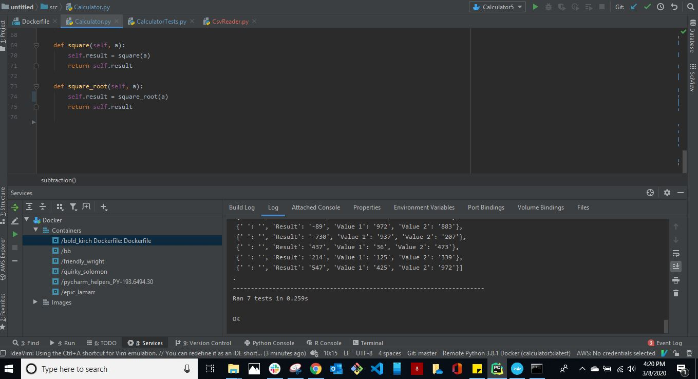

# pycalculator
## by Wismy Seide

### Python Calculator with the following:
* Addition
* Subtraction
* Multiplication
* Division
* Square Root
* Square

### Test CSV for addition, subtraction, multiplication, division, square root, square added

